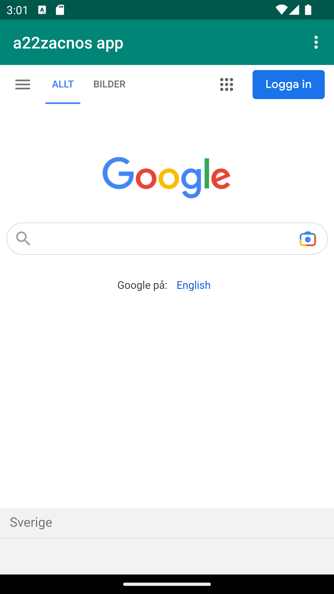

# Rapport

**The first bit of code displays the webview being instantiated. "myWebView = (WebView) findViewById(R.id.my_webview);" links the myWebView variable with the graphical WebView element in activity_main.xml
    "WebViewClient myWebClient = new WebViewClient();" and "myWebView.setWebViewClient(myWebClient);" creates a WebViewClient and attaches it to the WebView, with " myWebView.getSettings().setJavaScriptEnabled(true);"
    enabling javascript execution. When called, "myWebView.loadUrl("https://www.google.com/");" and "myWebView.loadUrl("file:///assets/example.html");" will change the url that is shown in the webview. The first picture,
    external.png, shows how the external web page looks and the second, internal.png, shows how the internal web page.**


## Följande grundsyn gäller dugga-svar:

- Ett kortfattat svar är att föredra. Svar som är längre än en sida text (skärmdumpar och programkod exkluderat) är onödigt långt.
- Svaret skall ha minst en snutt programkod.
- Svaret skall inkludera en kort övergripande förklarande text som redogör för vad respektive snutt programkod gör eller som svarar på annan teorifråga.
- Svaret skall ha minst en skärmdump. Skärmdumpar skall illustrera exekvering av relevant programkod. Eventuell text i skärmdumpar måste vara läsbar.
- I de fall detta efterfrågas, dela upp delar av ditt svar i för- och nackdelar. Dina för- respektive nackdelar skall vara i form av punktlistor med kortare stycken (3-4 meningar).

Programkod ska se ut som exemplet nedan. Koden måste vara korrekt indenterad då den blir lättare att läsa vilket gör det lättare att hitta syntaktiska fel.

```
 private WebView myWebView;

    public void showExternalWebPage(){
        myWebView.loadUrl("https://www.google.com/");
    }

    public void showInternalWebPage(){
        myWebView.loadUrl("file:///assets/example.html");}
    }

    @Override
    protected void onCreate(Bundle savedInstanceState) {
        super.onCreate(savedInstanceState);
        setContentView(R.layout.activity_main);
        Toolbar toolbar = findViewById(R.id.toolbar);
        setSupportActionBar(toolbar);

        myWebView = (WebView) findViewById(R.id.my_webview);
        WebViewClient myWebClient = new WebViewClient();
        myWebView.setWebViewClient(myWebClient);
        myWebView.getSettings().setJavaScriptEnabled(true);
    }
```
Bilder läggs i samma mapp som markdown-filen.




Läs gärna:

- Boulos, M.N.K., Warren, J., Gong, J. & Yue, P. (2010) Web GIS in practice VIII: HTML5 and the canvas element for interactive online mapping. International journal of health geographics 9, 14. Shin, Y. &
- Wunsche, B.C. (2013) A smartphone-based golf simulation exercise game for supporting arthritis patients. 2013 28th International Conference of Image and Vision Computing New Zealand (IVCNZ), IEEE, pp. 459–464.
- Wohlin, C., Runeson, P., Höst, M., Ohlsson, M.C., Regnell, B., Wesslén, A. (2012) Experimentation in Software Engineering, Berlin, Heidelberg: Springer Berlin Heidelberg.
